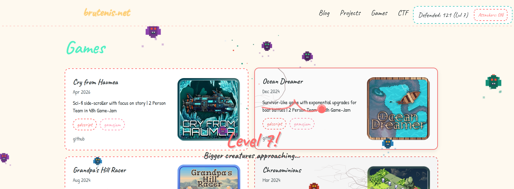

# [brutenis.net](https://brutenis.net)

My personal website built with [Astro](https://astro.build), [Tailwind CSS v4](https://tailwindcss.com), and TypeScript. Has a yarn ball cursor with Verlet rope physics and a fun little game mode where monsters attack the blog entries. You can try to defend against the monsters with the yarn ball, but it's quite hard!



## Setup
```sh
npm install
npm run dev      # localhost:4321
npm run build
npm run preview
```

## Content

Four content collections defined in `src/content.config.ts`.

### Blog

Two sources, combined by `src/lib/blog-loader.ts`:

#### 1. Local Markdown files

Drop a `.md` file in `src/content/blog/`. The filename becomes the slug.

Frontmatter:

```yaml
---
title: "My Post Title"
description: "A short description"
pubDate: 2025-01-15
updatedDate: 2025-02-01      # optional
tags: ["astro", "web"]        # optional, defaults to []
heroImage: "/images/hero.png" # optional
draft: false                  # optional, defaults to false (drafts are excluded)
---

Your markdown content here.
```

#### 2. GitHub repository READMEs

Add a repo to the `githubRepos` array in `src/content.config.ts`. The README is fetched at build time and rendered as a blog post.

```ts
const blog = defineCollection({
  loader: blogLoader({
    contentDir: "./src/content/blog",
    githubRepos: [
      {
        repo: "LiquidFun/godot-tween-cheatsheet", // required: owner/repo
        tags: ["godot", "gamedev"],                // optional
        title: "Custom Title",                     // optional, defaults to repo name
        description: "Custom description",         // optional, defaults to repo description
        pubDate: "2024-06-01",                     // optional, defaults to repo creation date
      },
    ],
  }),
  // ...
});
```

### Projects & Games

Both collections are parsed from the [LiquidFun GitHub profile README](https://github.com/LiquidFun) by `src/lib/github-loader.ts`. To add a project or game, add an entry to the relevant section in the [LiquidFun/LiquidFun](https://github.com/LiquidFun/LiquidFun) profile README:

```html
<a href="https://github.com/User/repo" title="Project Name - Description of the project">
  
</a>
```

Pages are at `/projects/<slug>` and `/games/<slug>`.

### CTF Writeups

Loaded from [LiquidFun/CTF-Writeups](https://github.com/LiquidFun/CTF-Writeups) by `src/lib/ctf-loader.ts`, which clones/pulls the repo into `ctf-writeups/` at build time.

Directory structure:

```
ctf-writeups/
  EventName2024/
    ChallengeName/
      README.md       # writeup content (title extracted from first # heading)
      media/          # optional, images/files referenced in the writeup
  AnotherCTF2023/
    SomeChallenge/
      README.md
```

To add a new writeup:
1. Create a directory under the event name (e.g., `EventName2024/ChallengeName/`)
2. Write a `README.md` with a `# Title` heading and your writeup content
3. Place any images in a `media/` subdirectory and reference them as `./media/image.png`

The loader automatically:
- Parses the year from the event directory name
- Copies media files to `public/ctf-assets/<event>/<challenge>/`
- Rewrites media paths in the markdown accordingly
- Generates tags from the event name

Pages are rendered at `/ctf/<event>/<challenge>`.

### About Page

The about page is a standalone Astro component at `src/pages/about.astro`. Edit it directly — it's plain HTML/Astro markup, not a content collection.

## Deployment

Pushing to `main` triggers the GitHub Actions workflow (`.github/workflows/deploy.yml`), which:

1. Checks out the repo
2. Restores cached CTF writeups
3. Installs dependencies and builds the site
4. Deploys `dist/` via rsync to the Hetzner server

Required GitHub secrets: `HETZNER_HOST`, `HETZNER_USER`, `DEPLOY_SSH_KEY`, `DEPLOY_PATH`.
